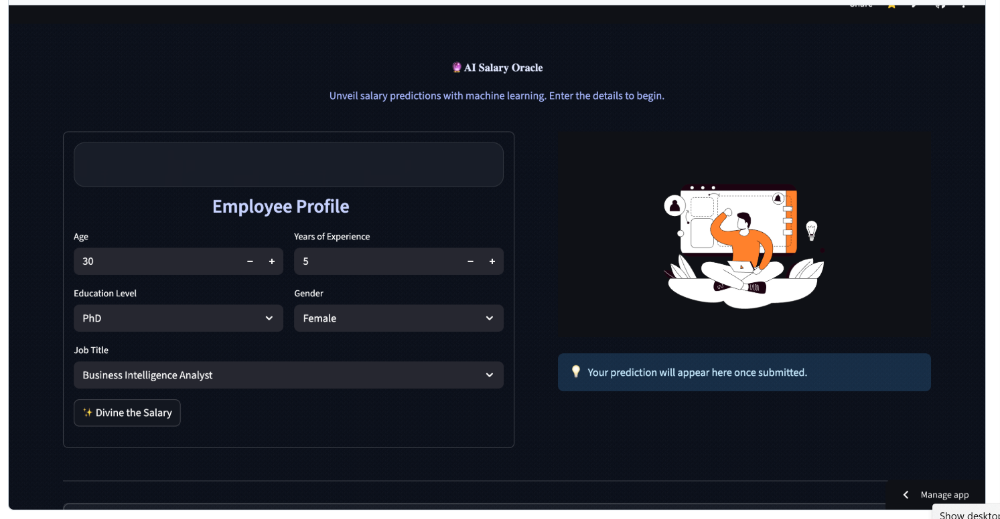
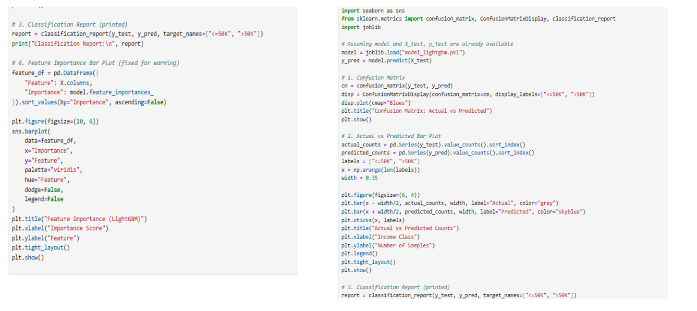
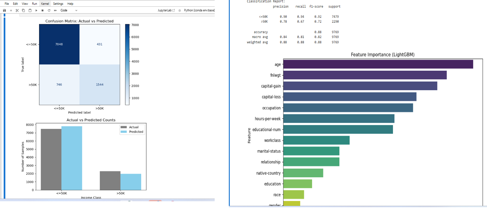
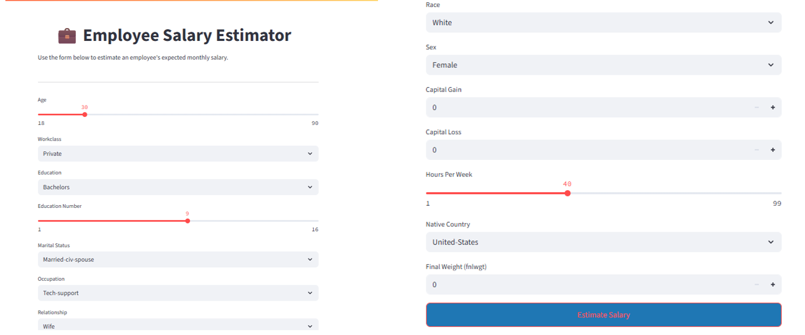

# 🧠 Employee Salary Prediction Using Machine Learning

## 📌 Objective
To develop a simple machine learning model that predicts salary using historical employee data.

## 📂 Project Files
- `Salary_Data.csv` → The dataset used for training  
- `salary_predict.py` → Python script to train and test the model  
- `model.pkl` → Saved machine learning model  
- `README.md` → Project documentation  

## 🛠️ Tools & Libraries Used
System requirements                                   
     Python
     Jupyter Notebook/ VS Code
     Streamlit for Web App development
Library required to build the model
     pandas, numpy
     scikit- learn
     lightgbm
     matplotlib, seaborn
     streamlit


## 🔍 How It Works
1. Load the dataset  
2. Train a Linear Regression model using scikit-learn  
3. Save the trained model as `model.pkl`  
4. Use it to predict salary for any years of experience  

## 🧪 Sample Prediction Output

```

Predicted Salary for 5 years exp: ₹78342.25

````

## 💡 Usage
You can reuse this model to predict salaries by changing the input value in the script:

```python
exp = [[7]]  # for 7 years of experience
prediction = model.predict(exp)
print(f"Predicted Salary for 7 years exp: ₹{prediction[0]}")
````

## 🚀 Setup & Installation

1. Clone this repository or download the files
2. Install the required libraries using:

```bash
pip install -r requirements.txt
```

3. Run the script:

```bash
python salary_predict.py
```

## 📊 Model Evaluation Results

### 📌 Salary Distribution by Experience


### 📌 Predicted vs Actual Salaries


### 📌 Feature Importance


### 📌 Model Performance Metrics



```

---

