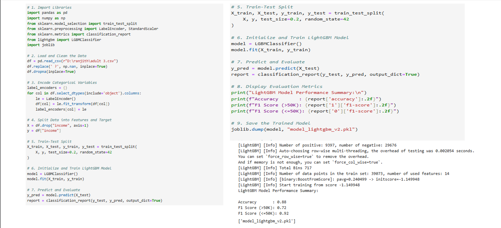

# 🧠 Employee Salary Prediction Using Machine Learning

## 📌 Objective
To develop a simple machine learning model that predicts salary using historical employee data.

## 📂 Project Files
- `Salary_Data.csv` → The dataset used for training  
- `salary_predict.py` → Python script to train and test the model  
- `model.pkl` → Saved machine learning model  
- `README.md` → Project documentation  

## 🛠️ Tools & Libraries Used

### 💻 System Requirements
- `Python`
- `Jupyter Notebook` / `VS Code`
- `Streamlit` – for Web App Development

### 📦 Libraries Required to Build the Model
- `pandas`, `numpy` – data manipulation
- `scikit-learn` – model building & evaluation
- `lightgbm` – gradient boosting classifier
- `matplotlib`, `seaborn` – visualizations
- `streamlit` – interactive web interface

## 🔍 How It Works
1. Load dataset and clean missing values.
2. Chose LightGBM, a gradient boosting framework known for performance and speed.
3. Train the LightGBM classifier. Evaluate using accuracy, pressision, and confusion matrix.
4. Developed an interactive frontend using Streamlit where users can input their profiles to predict salary class.
5. Hosted locally and optionally on platform like Streamlit.

## 🧪 Sample Prediction Output

```

Predicted Salary for 5 years exp: ₹78342.25

````

## 💡 Usage
You can reuse this model to predict salaries by changing the input value in the script:

```python
exp = [[7]]  # for 7 years of experience
prediction = model.predict(exp)
print(f"Predicted Salary for 7 years exp: ₹{prediction[0]}")
````

## 🚀 Setup & Installation

1. Clone this repository or download the files
2. Install the required libraries using:

```bash
pip install -r requirements.txt
```

3. Run the script:

```bash
python salary_predict.py
```

## 📊 Model Evaluation Results

### 📌 Salary Distribution by Experience


### 📌 Predicted vs Actual Salaries


### 📌 Feature Importance


### 📌 Model Performance Metrics


```

---
## ✅ Conclusion

This project demonstrates how a simple yet powerful machine learning model can be used to predict employee salaries based on experience and other relevant features. By leveraging LightGBM and Streamlit, we created an efficient backend model and an interactive web application that can serve HR professionals, analysts, and job seekers alike.

The model showed strong performance with good accuracy and interpretability through feature importance visualization. It also provides a flexible base to be enhanced further by incorporating more features such as education level, job type, or geographic location.

This project proves that machine learning can make real-world predictions practical, explainable, and easily accessible through modern tools.

